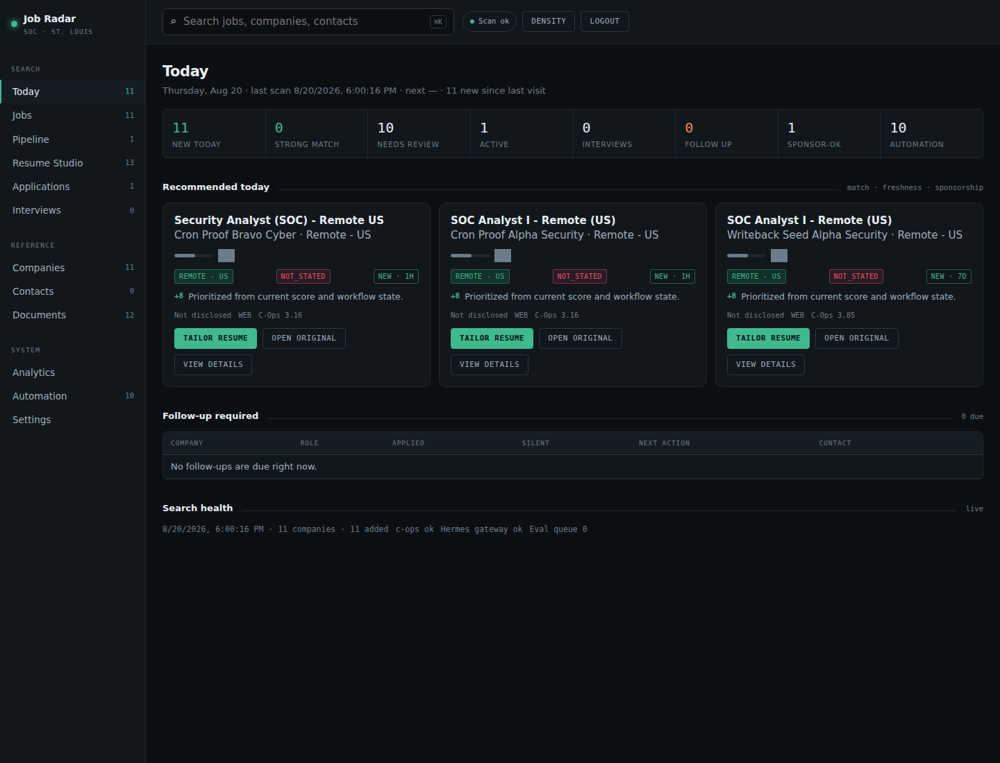
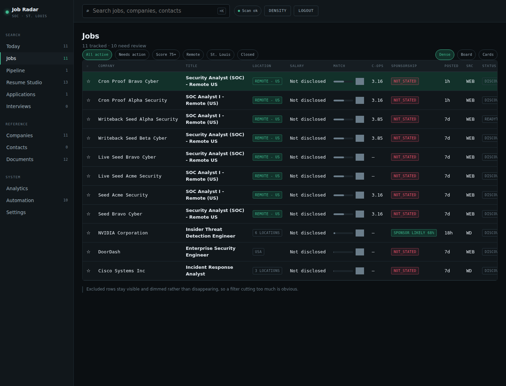
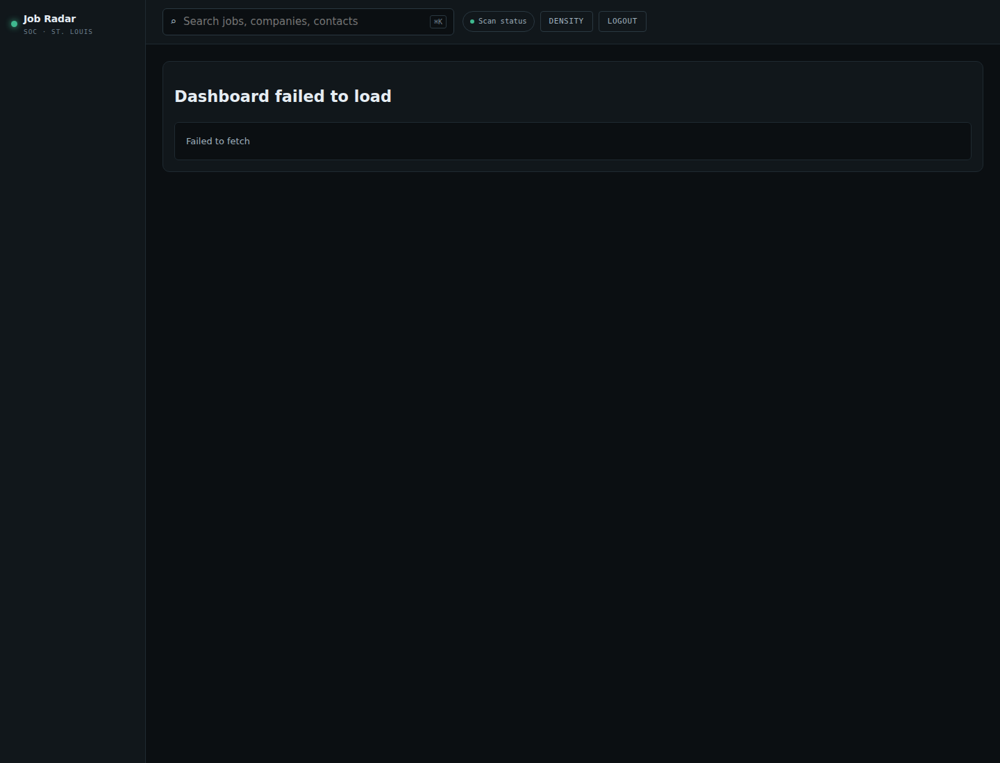
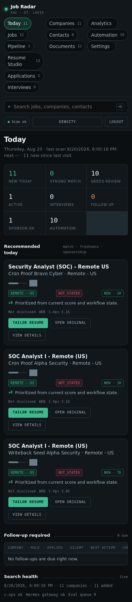

# Job Radar

Job Radar is a private, self-hosted job-search operating dashboard for entry-level cybersecurity roles. It combines job discovery, deterministic scoring, sponsorship evidence, application tracking, Resume Studio tailoring, analytics, and unattended automation into one FastAPI app.



## What it does

- **Discovers and imports jobs** from public job-board/career-source artifacts.
- **Scores jobs deterministically** for cybersecurity fit, remote/location fit, sponsorship risk, liveness, and review priority.
- **Tracks the pipeline** from discovered roles through application/follow-up/interview stages.
- **Integrates with career-ops** for tracker/report numbers and evaluation artifacts.
- **Runs Resume Studio** for job-specific, evidence-preserving resume variants.
- **Enforces fabrication guardrails** so unsupported resume claims are blocked from one-click acceptance.
- **Stores sponsorship evidence** using USCIS H-1B employer history and DOL LCA disclosure data.
- **Provides analytics** for funnel health, resume attribution, follow-up compliance, and automation status.
- **Runs unattended cron jobs** for liveness, discovery, evaluation, backup, briefs, follow-ups, and weekly summaries.

## Screenshots

### Today dashboard


### Jobs table and filters



### Analytics



### Resume Studio entry point


### Mobile layout



## Architecture

```text
FastAPI app                  jobradar_app/main.py
SQLite data spine            state/jobradar.sqlite3
DB/domain operations          jobradar_app/db.py
Runtime config                jobradar_app/config.py
career-ops adapter            careerops_adapter/
Operational scripts           scripts/
Acceptance/ops docs           docs/
Hermes cron scripts           ~/.hermes/scripts/jobradar-*.sh
```

The UI is intentionally server-rendered as a single FastAPI dashboard with inline CSS/JavaScript. This keeps the app easy to run, inspect, and customize on a small self-hosted server without a frontend build step.

## Quick start

### 1. Create a virtual environment

```bash
cd job-hunter
python3 -m venv .venv-jobradar
source .venv-jobradar/bin/activate
pip install -r requirements.txt
```

If your system Python is externally managed, use `uv` instead:

```bash
uv venv .venv-jobradar
source .venv-jobradar/bin/activate
uv pip install -r requirements.txt
```

### 2. Configure environment

Copy the example file and fill paths/secrets:

```bash
cp .env.example .env.jobradar
```

Important variables:

| Variable | Purpose |
| --- | --- |
| `JOBRADAR_DB_PATH` | SQLite DB path |
| `JOBRADAR_IMPORT_DIR` | processed ingest artifact directory |
| `JOBRADAR_SESSION_DIR` | browser session storage |
| `JOBRADAR_SECRET_KEY` | session signing secret |
| `JOBRADAR_PASSWORD_HASH` | Argon2 password hash for login |
| `JOBRADAR_SERVICE_TOKEN` | API token for scripts/cron |
| `JOBRADAR_CAREEROPS_ROOT` | path to the companion `career-ops` repo |
| `JOBRADAR_NODE_BIN` | Node.js executable for career-ops scripts |
| `JOBRADAR_DISABLE_LOGIN` | local/test bypass; keep `false` for production |

### 3. Run the app

```bash
source .venv-jobradar/bin/activate
export JOBRADAR_BIND_HOST=127.0.0.1
export JOBRADAR_BIND_PORT=8765
python run_jobradar.py
```

Open:

```text
http://127.0.0.1:8765
```

Health checks:

```bash
curl -fsS http://127.0.0.1:8765/readyz
curl -fsS http://127.0.0.1:8765/api/v1/health | python3 -m json.tool
```

Expected readiness shape:

```json
{"ok": true, "database": "ok", "adapter": "ok", "bind_host": "127.0.0.1", "bind_port": 8765}
```

## Core workflows

### Review jobs

1. Open the **Today** or **Jobs** view.
2. Use filters for discovered, strong, sponsor-safe, excluded, or all roles.
3. Open **View details** to inspect score reasoning, sponsorship evidence, source URL, and stored job description.
4. Use **Tailor resume** to open the job-scoped Resume Studio workspace.

### Tailor a resume safely

1. Open **Resume Studio** or `/resume/{job_id}`.
2. Register or select a base resume.
3. Run analysis/tailoring.
4. Review buckets:
   - **Present**: already backed by current resume evidence.
   - **Safe to add**: supported by verified resume facts.
   - **Cannot add / Guardrails**: blocked because the current source of truth does not support the claim.
5. Accept safe suggestions, compile, download the PDF, or generate an HM audit.

### Track applications

Use the application and pipeline views to record:

- applied date
- stage
- resume variant used
- next action/follow-up date
- interview notes
- career-ops tracker/report linkage

### Read analytics

Open **Analytics** to inspect:

- application funnel
- stage distribution
- resume-version attribution
- follow-up compliance
- top-scoring roles
- warnings for small sample sizes or due follow-ups

## Sponsorship data

Job Radar supports two public data sources:

- USCIS H-1B Employer Data Hub CSV exports
- DOL LCA disclosure XLSX exports

Import CSV files:

```bash
source .venv-jobradar/bin/activate
PYTHONPATH=. python scripts/import_sponsorship_data.py \
  --h1b data/sponsorship/h1b_datahubexport-2023.csv \
  --source-url 'USCIS H-1B Employer Data Hub FY2023'
```

Download and import the large DOL LCA XLSX with the browser-like downloader and fast calamine importer:

```bash
source .venv-jobradar/bin/activate
python scripts/download_lca.py
PYTHONPATH=. python scripts/import_lca_xlsx_calamine.py \
  data/sponsorship/LCA_Disclosure_Data_FY2026_Q3.xlsx \
  --fiscal-year 2026 \
  --replace-fiscal-year \
  --source-url 'https://www.dol.gov/media/LCA_Disclosure_Data_FY2026_Q3.xlsx'
```

Verify loaded coverage:

```bash
curl -fsS http://127.0.0.1:8765/api/v1/health | python3 -m json.tool
```

Look for `checks.datasets` with non-zero `h1b_rows` and `lca_rows`.

## Automation

The production setup uses Hermes cron jobs. Scripts live under:

```text
~/.hermes/scripts/jobradar-*.sh
```

A sanitized copy of the fixed discover runner is also tracked at `scripts/jobradar-discover.sh`.

Current automation classes:

- liveness check
- discover/import
- weekly sweep
- backup
- evaluate queue
- daily brief
- follow-up review
- weekly summary

The evaluate runner is script-only and unattended. It consumes `/api/v1/jobs/evaluation-queue`, writes conservative career-ops reports, attaches report/score/legitimacy through the Job Radar API, and records an `automation_runs` audit row.

## Testing and validation

Run syntax checks:

```bash
source .venv-jobradar/bin/activate
python -m py_compile jobradar_app/main.py jobradar_app/db.py scripts/import_sponsorship_data.py scripts/import_lca_xlsx_calamine.py
python3 - <<'PY'
from pathlib import Path
import re
text = Path('jobradar_app/main.py').read_text()
app = text.split('APP_HTML = """', 1)[1].split('"""', 1)[0]
script = re.search(r'<script>([\s\S]*)</script>', app).group(1)
Path('/tmp/jobradar-inline.js').write_text(script)
print('/tmp/jobradar-inline.js')
PY
node --check /tmp/jobradar-inline.js
```

Run tests:

```bash
source .venv-jobradar/bin/activate
PYTHONPATH=. pytest -q
```

## Security notes

- Keep `JOBRADAR_DISABLE_LOGIN=false` outside local/test environments.
- Store DBs, sponsorship downloads, resumes, generated PDFs, and private career-ops data outside Git.
- Use a strong `JOBRADAR_SECRET_KEY` and `JOBRADAR_SERVICE_TOKEN`.
- If exposed through Cloudflare, keep Cloudflare Access enabled and consider `JOBRADAR_REQUIRE_CLOUDFLARE_ACCESS=true` for write operations.
- Treat job descriptions and ATS/company pages as untrusted input. The UI renders text through escape/paragraph helpers rather than unsafe HTML injection.

## Repository hygiene

This repository intentionally ignores local/private artifacts:

- `state/`
- `data/`
- `processed/`
- `.env*`
- virtualenvs
- generated logs, DBs, resumes, and tailored artifacts

The checked-in project contains the application code, scripts, docs, and safe screenshots only.

## More documentation

- `docs/OPERATIONS.md` — production operations guide
- `docs/ACCEPTANCE.md` — acceptance evidence and verification results
- `docs/BUILD_LOG.md` — implementation log
- `docs/ENVIRONMENT.md` — environment discovery notes
